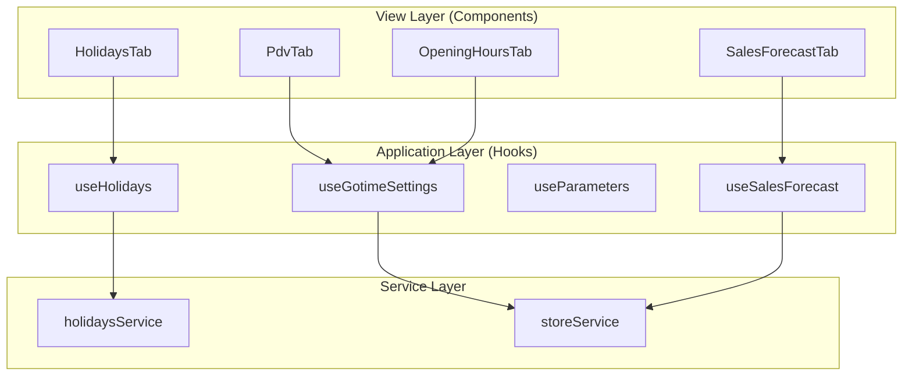

# System Patterns: Gotime Settings Module

## Architecture Overview



## Key Patterns

### 1. Service Layer Pattern

Services in `src/services/` encapsulate all data access:

- Framework-agnostic (no React imports)
- Return Promises with typed data
- Handle error transformation
- Currently using mock data with simulated delays

```typescript
// Example: holidaysService.ts
export const HolidaysService = {
  list: async (storeId: string): Promise<Holiday[]> => {...},
  create: async (data: CreateHolidayDTO): Promise<Holiday> => {...},
  update: async (id: string, data: UpdateHolidayDTO): Promise<Holiday> => {...},
  delete: async (id: string): Promise<void> => {...}
};
```

### 2. Custom Hook Pattern

Hooks in `src/hooks/` manage state and effects:

- Consume services for data operations
- Expose state and callbacks to components
- Handle loading/error states
- Provide derived data

### 3. Presentational Component Pattern

Components focus on rendering:

- Receive data via props or hooks
- Return only Ant Design JSX
- No direct API calls
- Minimal business logic

### 4. Ant Design Token System

All styling uses design tokens:

```typescript
const { token } = theme.useToken();
// Use: token.colorPrimary, token.paddingLG, etc.
```

### 5. Form Handling

Using Ant Design Form with type-safe patterns:

- `Form.useForm<FormType>()`
- `Form.Item` with validation rules
- Drawer-based forms for complex entities

## Component Relationships

| Component        | Primary Hook      | Service            |
| ---------------- | ----------------- | ------------------ |
| HolidaysTab      | useHolidays       | holidaysService    |
| PdvTab           | useGotimeSettings | storeService       |
| OpeningHoursTab  | useGotimeSettings | storeService       |
| SalesForecastTab | useSalesForecast  | (pending refactor) |
| ParametersTab    | useParameters     | (pending refactor) |
